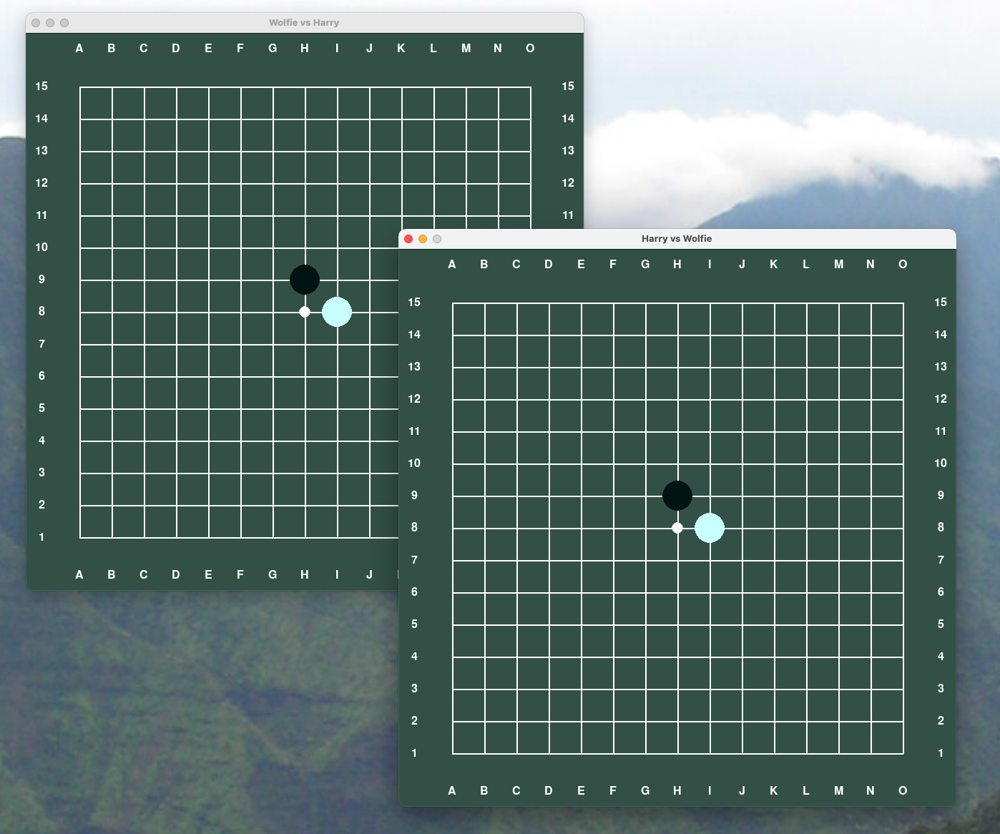

# compman




### Server and client code to interactively play gomoku on two boards

You'll have three processes running that all need the same pipenv python
environment. So make sure you have 3 shells ready.

1) Get yourself a proper environment, that's either of
  - Linux, 
  - MacOS, 
  - or WSL on Windows
  
2) Install the runtime 
    - python3.8+
    - pipenv

3) Get the project's source code

```
git clone https://github.com/Project-Ellie/compman
cd compman/
```

4) Get the python environment ready
```pipenv install``` 


5) Now, for each of the 3 shells, do

```
cd compman/
pipenv shell
export DJANGO_SETTINGS_MODULE=django_project.settings
```

6) On the first shell, create the schema and start the server
```
# Create the database schema in db.sqllite3
# First you'll see the log of the schema creation. It'll create a file db.sqllite3
# Then, a Django server process should start up and tell you that it is listening on port 8000
./manage.py migrate
./manage.py runserver
```

7) On the first shell, the server serves the board:
```
# Register two players ('Harry' and 'Wolfie') and a new Gomoku board
cd compman/
pipenv shell
export DJANGO_SETTINGS_MODULE=django_project.settings
./setup
```

8) On another shell, start Wolfie's view of the board
```
# Start Wolfie's board
cd compman/
pipenv shell
./cm games --play
```

9) On yet another shell, start Harry's view of the board 
```
cd compman/
pipenv shell
./cm games --play -R .compmanrc-harry
```

Now you should have two green Gomoku boards up and running, and now can play against yourself!

